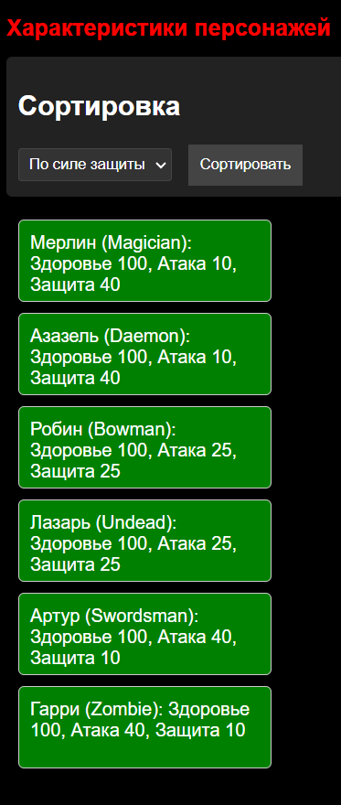

# Задание № 1 к лекции «Классы, наследование» -(базовый класс и наследники)

[](https://ci.appveyor.com/project/NMYurchenko-max/ajs-hw-5-1-inheritsclasses)

## Описание проекта

[Задача](https://github.com/netology-code/ajs-homeworks/blob/ajs8/oop/README.md)
Программа реализует иерархию классов персонажей, где Character является базовым классом, а остальные классы наследуются от него, задавая свои уникальные характеристики атаки и защиты.

### Реализация

#### Структура проекта

```plaintext

project-root/
├── .gitconfig
├── .husky/
├── .babelrc
├── .browserslistrc
├── .eslint.config.mjs
├── appveyor.yml
├── package.json
├── coverage/                # Папка для покрытия тестов
├── dist/                    # Папка для выходных файлов
│   └── index.html           # Скомпилированный HTML файл
│   └── bundle.js            # Скомпилированный JavaScript файл
|   └── style.css            # Скомпилированный CSS файл
├── src/
│   ├── index.html           # Файл HTML (главный файл)
|   ├── index.js             # скрипты и стили не подключать (структура, блоки)
│   ├── js/                  # Папка для JavaScript файлов 
│   │    ├── Character.js    # Родительский класс персонажей:характеристики поумолчанию
│   │    │ heajth(уровень здоровье): 100%, level(уровень персонажа) :1
│   │    │# attack/defense (атака/защита) персонажей ('name'):
│   │    ├─  characterTypes.js   # Классы наследников от Character
│   │    └── app.js           # Главный файл приложения 
│   │    └── __tests__/       # Папка для тестов
│   │            ├── сharacter.test.js
│   │            ├── characterTypes.test.js
│   │            
│   │
│   └── css/                 # Папка для CSS файлов
│       └── styles.css       # Файл стилей
└── webpack.config.js
└── README.md
```

Придумаем имена для героев, соответствующие их типам и характеристикам атаки и защиты:

Bowman (Лучник), Атака/защита: 25/25
Имя: Робин (в честь Робин Гуда, известного лучника)
Swordsman (Мечник), Атака/защита: 40/10
Имя: Артур (в честь короля Артура, легендарного мечника)
Magician (Фокусник), Атака/защита: 10/40
Имя: Мерлин (как вы уже предложили, в честь известного волшебника)
Undead (Нежить), Атака/защита: 25/25
Имя: Лазарь (в честь библейского персонажа, который воскрес из мертвых)
Zombie (Зомби), Атака/защита: 40/10
Имя: Гарри (можно выбрать любое имя)
Daemon (Демон), Атака/защита: 10/40
Имя: Азазель (в честь демона из мифологии)

#### Классы

1. Базовый класс выполняет задачи проверки длины типов имен персонажей и устанавливает характеристики по умолчанию:

```js
export default class Character {
  constructor(name) {
    // проверка поставленного условия длины строки имени
    if (name === undefined || name.length < 2 || name.length > 10) {
      throw new Error('Имя должно быть строкой от 2 до 10 символов включительно');
    } 
    // характеристики по умолчанию (by default)
    this.name = name;
    this.level = 1;
    this.health = 100;
  }
}
```

Дочерние классы наследуют свойства и методы от базового класса и добавляют свои уникальные характеристики, например:

```js
import Character from './Character';

class Bowerman extends Character {
  constructor(name) {
    // наследуем
    super(name); 
    // добавляем свои характеристики
    this.type = "Bowerman";
    this.attack = 25; 
    this.defence = 25;
  }
}
```

#### Тестирование

Для тестов используется библиотека Jest, выбираем из подходящих вариантов:

`.toEqual(value)` - Проверяет, что объекты имеют одинаковое значение, у нас - соответствие заданной длине строки.
`.toThrow` - Имя должно быть от 2 до 10 символов/ Проверяет, что функция выбрасывает ошибку.
`.toBe(value)`- Проверяет строгое равенство.
`.toBeInstanceOf(Class)` -Проверяет, что объект является экземпляром указанного класса.
`expect.objectContaining(object)` - Проверяет, что объект содержит указанные свойства.
`toBeGreaterThan()` и `toBeGreaterThanOrEqual()` — первый метод проверяет или переданное числовое значение больше, чем ожидаемое >, второй проверяет больше или равно ожидаемому >=.
`toBeLessThan()` и `toBeLessThanOrEqual()` — противоположность `toBeGreaterThan()` и `toBeGreaterThanOrEqual()`.
`toBeDefined()` - Проверяет, что переменная не равна undefined.
`toBeTruthy()` - Проверяет, что переменная равна true.

Установлено 2 файла теста (для базового класса и классов) по принципу 100% покрытия:

**Проверяем родительский класс** `character.test.js`
(src/tests/character.test.js)

`.toBeInstanceOf(Class)` - проверяет, что объект является экземпляром указанного класса - проверяет корректную установку значений по умолчанию.
На ошибки: `toTrow` - Проверяет, что функция выбрасывает ошибку.

- Проврерка длины строки имени
- Проверяем на число
- Проверка на строку
- Проверка пограничных значений чисел

**Проверяем дочерние классы** `characterTypes.test`
(src/tests/characterTypes.test.js)

Проверяется каждый тип персонажа и проверяются его характеристики на соответствие

- `should create correct object` - Проверяет, что объект создан корректно, содержит указанные свойства и значения - наследует их от родителей и добавляет свои.

#### Демонстрация приложения

Доработка для НАГЛЯДНОСТИ ПРИЛОЖЕНИЯ перед сборкой проекта.
Я использую ранее разработанный проект
[Сортировка персонажей по здоровью](https://github.com/NMYurchenko-max/ajs-hw-3.2-matchers)
и добавляю в него файлы из текущего проекта. В функцию сортировки добавляю проверку по другим критериям.
В файл `index.html` добавляем блок сортировки персонажей по здоровью, удару и защите.
В файл `css` добавляем css стили для сортировки.

1. В главный файл приложения `app.js` добавляем импорты классов и создаем экземпляры персонажей
2. Создаем массив персонажей
3. Создаем функцию для отображения персонажей на странице
   с сортировкой персонажей, по состоянию здоровья, по значению удара, по значению защиты
4. экспортируем функцию для отображения персонажей на странице в файл `index.js`

Для сборки проекта используйте команду: `npm run build`,

Для запуска сервера разработки используйте команду: `npm start`.

Для обязательного выполнения проверки работоспособности перед каждым коммитом в git с помощью хука precommit выполняются три команды `lint`, `test`, `build`.

**Результат:**


## Сделана интеграция с AppVeyor

[ajs-hw-5-1-inheritsclasses.AppVeyor](https://ci.appveyor.com/project/NMYurchenko-max/ajs-hw-5-1-inheritsclasses)

## Использование проекта

Для использования проекта необходимо склонировать репозиторий:

```bash

git clone https://github.com/NMYurchenko-max/ajs-hw-5.1-InheritsClasses.git
```

После чего установить зависимости:

```bash
npm install
```
